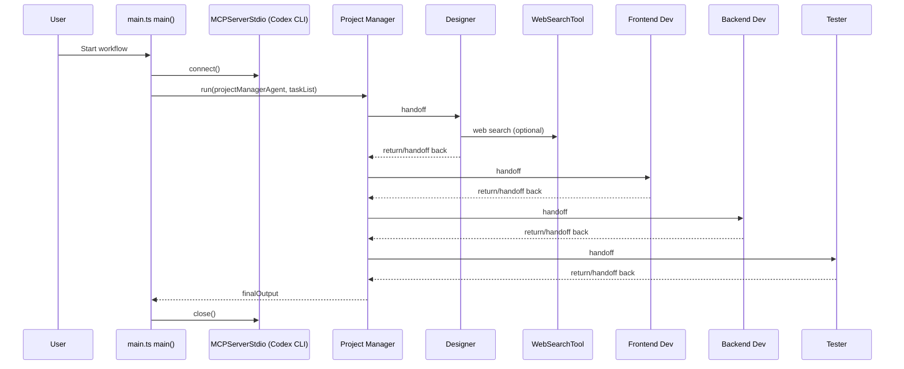

# Multi-Agent Architecture (OpenAI Agents SDK)

```mermaid
flowchart TD
    U[User / Task List] --> E[Entrypoint: main()]
    E --> PM[Project Manager Agent]
    PM --> D[Designer Agent]
    PM --> FE[Frontend Developer Agent]
    PM --> BE[Backend Developer Agent]
    PM --> T[Tester Agent]

    D --> PM
    FE --> PM
    BE --> PM
    T --> PM

    D --> WS[Web Search Tool]
    PM --> MCP[Codex MCP Server]
    D --> MCP
    FE --> MCP
    BE --> MCP
    T --> MCP
```



## 1. List of all agents
1. `Project Manager Agent`
   - Defined in `codex_sdk/src/main.ts` at symbol `projectManagerAgent` (`new Agent(...)`, line 62).
2. `Designer Agent`
   - Defined in `codex_sdk/src/main.ts` at symbol `designerAgent` (line 73).
3. `Frontend Developer Agent`
   - Defined in `codex_sdk/src/main.ts` at symbol `frontendDeveloperAgent` (line 82).
4. `Backend Developer Agent`
   - Defined in `codex_sdk/src/main.ts` at symbol `backendDeveloperAgent` (line 90).
5. `Tester Agent`
   - Defined in `codex_sdk/src/main.ts` at symbol `testerAgent` (line 98).

Notebook parity (same role set) is present in:
- `notebooks/building_consistent_workflows_codex_cli_agents_sdk.ipynb`
  - `designer_agent` (line 257489)
  - `frontend_developer_agent` (line 257498)
  - `backend_developer_agent` (line 257506)
  - `tester_agent` (line 257514)
  - `project_manager_agent` (line 257522)

## 2. Their tools
1. `Designer Agent`
   - Explicit tool: `webSearchTool()` in `codex_sdk/src/main.ts` line 77.
   - Notebook equivalent: `WebSearchTool()` at notebook line 257493.
2. `Project Manager Agent`
   - No explicit `tools` list in code.
3. `Frontend Developer Agent`
   - No explicit `tools` list in code.
4. `Backend Developer Agent`
   - No explicit `tools` list in code.
5. `Tester Agent`
   - No explicit `tools` list in code.

Note:
- Access to Codex MCP-provided capabilities through `mcpServers` is **inferred** from SDK behavior; only `Designer` has an explicit non-MCP tool configured in code.

## 3. Their MCP servers
Single MCP server used by all agents:
1. `codexMcp` created as `new MCPServerStdio({...})` in `codex_sdk/src/main.ts` line 51.
2. Server command: `npx -y @openai/codex@0.71.0 mcp-server` (`command` line 53, `args` line 54).
3. Attached to each agent via `mcpServers: [codexMcp]`:
   - PM: line 69
   - Designer: line 78
   - Frontend: line 86
   - Backend: line 94
   - Tester: line 102

Notebook mirrors the same MCP server pattern in `async with MCPServerStdio(...)`:
- `notebooks/building_consistent_workflows_codex_cli_agents_sdk.ipynb` lines 257482-257486 and `mcp_servers=[codex_mcp_server]` in each agent block.

## 4. Handoffs / delegation relationships
From `codex_sdk/src/main.ts`:
1. `Designer -> Project Manager`
   - `designerAgent` has `handoffs: [projectManagerAgent]` (line 79).
2. `Frontend -> Project Manager`
   - `frontendDeveloperAgent` has `handoffs: [projectManagerAgent]` (line 87).
3. `Backend -> Project Manager`
   - `backendDeveloperAgent` has `handoffs: [projectManagerAgent]` (line 95).
4. `Tester -> Project Manager`
   - `testerAgent` has `handoffs: [projectManagerAgent]` (line 103).
5. `Project Manager -> Designer, Frontend, Backend, Tester`
   - `(projectManagerAgent as any).handoffs = [designerAgent, frontendDeveloperAgent, backendDeveloperAgent, testerAgent]` (lines 107-112).

Notebook defines the same star topology:
1. PM downstream handoffs:
   - `handoffs=[designer_agent, frontend_developer_agent, backend_developer_agent, tester_agent]` (line 257529).
2. Specialists hand off back to PM:
   - `designer_agent.handoffs = [project_manager_agent]` (257533)
   - `frontend_developer_agent.handoffs = [project_manager_agent]` (257534)
   - `backend_developer_agent.handoffs = [project_manager_agent]` (257535)
   - `tester_agent.handoffs = [project_manager_agent]` (257536)

## 5. Main entrypoint(s)
TypeScript implementation:
1. `main()` function in `codex_sdk/src/main.ts` line 28.
2. Invocation: `main().catch(...)` in `codex_sdk/src/main.ts` line 130.
3. Workflow launch: `run(projectManagerAgent, taskList.trim(), ...)` in line 114.
4. NPM scripts in `codex_sdk/package.json`:
   - `dev`: `tsx src/main.ts` (line 8)
   - `start`: `node dist/main.js` (line 10)

Notebook implementation:
1. `async def main() -> None:` in `notebooks/building_consistent_workflows_codex_cli_agents_sdk.ipynb` line 257481.
2. Launch path:
   - `await main()` if event loop is running (line 257554)
   - `asyncio.run(main())` fallback (line 257556)
3. Runner call:
   - `result = await Runner.run(project_manager_agent, task_list, max_turns=30)` (line 257544).

## Short explanation
The implemented system is a hub-and-spoke multi-agent orchestration: a Project Manager agent is the central coordinator, delegates to four specialist agents (Designer, Frontend, Backend, Tester), and each specialist is configured to hand control back to the PM. All five agents share the same Codex MCP server; only the Designer has an additional explicit web search tool.
